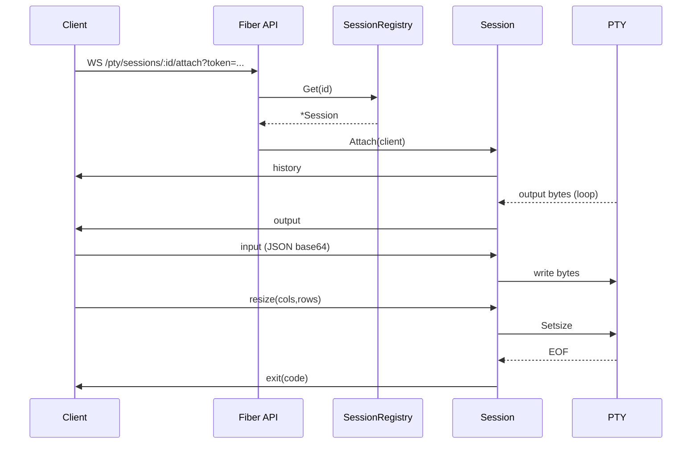

# PTY Process Manager Design

Purpose
-------
This document describes a design for a PTY-based process manager for mcrunner that allows multiple clients to create and attach to terminal processes (shells or other TTY programs), view the current terminal screen (via recent scrollback), and send input — similar to tmux, but implemented as a service using Go and github.com/creack/pty.

Goals
-----
- Provide an API to create named PTY sessions backed by OS processes (e.g., bash, sh, or custom command).
- Allow multiple clients to attach/detach to a session and see the most recent screen contents and live updates.
- Support input from clients, resize events, and basic access control.
- Maintain a bounded scrollback buffer so new attachments can catch up to recent output.
- Keep implementation small, testable, and safe for containerized environments.

Non-goals
---------
- Full tmux feature parity (splits, panes, layouts, persistent disk-backed sessions). Scope is a lightweight attachable PTY manager.

High-level architecture
-----------------------
- Session manager: central in-memory registry of active sessions keyed by session ID.
- Session: owns a single PTY (via github.com/creack/pty) and an OS process. It maintains:
  - the PTY file descriptor and I/O goroutines
  - a scrollback ring buffer (byte-oriented)
  - a list of attached clients (each is a WebSocket client) with write queues
  - a lock for state changes
- Transport: WebSocket for interactive attach (bi-directional). HTTP APIs create/list/terminate sessions.
- Access control: per-session token (or integrate with existing auth middleware). Role: read/write.

Core components
---------------
1) SessionRegistry
- map[string]*Session
- methods: Create(cmd []string, env map[string]string, cwd string) -> sessionID, Get(sessionID), Close(sessionID)
- TTL / auto-cleanup for idle or exited sessions

2) Session
- id string
- cmd []string
- pty *os.File
- proc *os.Process
- mu sync.RWMutex
- clients map[string]*ClientConn
- ring *RingBuffer (scrollback)
- cols, rows int
- closed bool

Lifecycle: Create -> Start process + start goroutines -> Accept client connections -> On Close: terminate process, close PTY, notify clients

3) ClientConn
- id string
- send chan []byte // messages to send to client
- attachedAt time.Time
- permissions: enum {read, write}

4) RingBuffer (scrollback)
- fixed capacity in bytes or lines (configurable); circular buffer that stores latest N bytes
- append(data []byte)
- snapshot() []byte // returns current contents in chronological order

Data flows
----------
- PTY -> session read loop: reads from PTY and:
  - writes to ring buffer
  - broadcasts to all attached clients (non-blocking with per-client buffers)
- Client -> WS read loop: receives control frames (input, resize) and forwards:
  - input -> write to PTY
  - resize -> call pty.Setsize (using pty.Setsize from github.com/creack/pty)

Message protocol (over WebSocket)
---------------------------------
Use a minimal JSON text message protocol. Binary frames could be added later for raw bytes.
Client -> Server:
- {"type":"input","data":"base64-encoded-bytes"}
- {"type":"resize","cols":120,"rows":40}
- {"type":"attach","session":"<id>","token":"..."}
Server -> Client:
- {"type":"output","data":"base64-encoded-bytes"}
- {"type":"history","data":"base64-encoded-bytes"} // initial scrollback
- {"type":"exit","code":0}
- {"type":"error","message":"..."}

Concurrency and backpressure
----------------------------
- Each client has a send channel with a fixed capacity (e.g., 128 messages). If the channel is full, drop oldest messages for that client or disconnect (configurable).
- PTY reads are tolerant to slow clients: we write to ring buffer and broadcast non-blocking.
- Writes to PTY from clients are serialized via a write mutex to avoid interleaving.

PTY size and screen model
-------------------------
- The PTY yields raw byte streams. To present a "current screen" to new attachments, we store raw bytes in a bounded ring buffer (scrollback). Clients render using their own terminal emulator (xterm-compatible) and can reconstruct a reasonable view.
- Optional improvement: rely on client-side terminal emulator (xterm.js) to parse ANSI escape sequences.

Security
--------
- Per-session token (opaque) required to attach.
- All I/O may contain secrets; sessions default to private and ephemeral.
- Recommend TLS for WebSocket transport and authenticate at reverse proxy.

Resizing
--------
- Clients send resize events; session updates its PTY size via github.com/creack/pty.Setsize.
- Track last known size; when starting the process, set initial size from the creating client or a default.

Example Go snippets
-------------------
Create a PTY and start a process (simplified):

```go
import (
    "os"
    "os/exec"
    "github.com/creack/pty"
)

func startProcess(cmdArgs []string, cols, rows int) (*os.File, *os.Process, error) {
    cmd := exec.Command(cmdArgs[0], cmdArgs[1:]...)
    // Optional: set env or working dir
    ptyFile, err := pty.StartWithSize(cmd, &pty.Winsize{Cols: uint16(cols), Rows: uint16(rows)})
    if err != nil {
        return nil, nil, err
    }
    return ptyFile, cmd.Process, nil
}
```

Read loop and ring buffer append (simplified):

```go
buf := make([]byte, 4096)
for {
    n, err := ptyFile.Read(buf)
    if n > 0 {
        data := make([]byte, n)
        copy(data, buf[:n])
        session.ring.Append(data)
        session.broadcastOutput(data)
    }
    if err != nil {
        // handle EOF / process exit
        break
    }
}
```

Write input from client to PTY:

```go
session.writeMu.Lock()
_, err := session.pty.Write(decodedInput)
session.writeMu.Unlock()
```

Handling resize:

```go
pty.Setsize(session.pty, &pty.Winsize{Cols: uint16(cols), Rows: uint16(rows)})
```

Initial history delivery on attach:
- When a client attaches, call session.ring.Snapshot() and send one "history" message with recent bytes (base64-encoded) so the client can render the latest state.

Operational concerns
--------------------
- Memory: bound ring buffer size per session (e.g., 1MB or 10k lines). Drop oldest data if exceeded.
- CPU: monitor; provide a debug endpoint to list sessions and PIDs.
- Crash handling: if process exits, mark session as closed and send exit message to clients. Optionally keep ring buffer for post-mortem.

Detailed integration with this repo
-----------------------------------
- HTTP framework: Fiber (see `internal/api/v1`). Add a new `PtyHandler` alongside `FilesHandler` and `ServerHandler`.
- Route group: `/api/v1` as in `routes.go`.
- Proposed endpoints:
  - POST `/api/v1/pty/sessions` → create
  - GET `/api/v1/pty/sessions` → list (admin/debug)
  - DELETE `/api/v1/pty/sessions/:id` → terminate
  - WS `/api/v1/pty/sessions/:id/attach` → attach (query: `token`, optional `cols`, `rows`)

Example request/response shapes
--------------------------------
- POST /api/v1/pty/sessions (JSON):

  Request:
  {
    "cmd": ["/bin/bash"],
    "env": {"TERM":"xterm-256color"},
    "cwd": "/home/mc",
    "cols": 120,
    "rows": 30,
    "name": "build-shell" // optional label
  }

  Success (BaseHandler envelope):
  {
    "apiVersion": "1.0",
    "data": {
      "id": "sess_01HJ...",
      "token": "s3cr3t",
      "pid": 4242,
      "cols": 120,
      "rows": 30,
      "createdAt": "2025-10-23T12:00:00Z"
    }
  }

WebSocket attach examples
-------------------------
Client connects: `GET /api/v1/pty/sessions/:id/attach?token=...`.

Initial messages from server:
- history (recent scrollback)
- output frames as new data arrives

Example frames:
- Client input:
  {"type":"input","data":"aGVsbG8K"} // "hello\n"
- Client resize:
  {"type":"resize","cols":160,"rows":42}
- Server history:
  {"type":"history","data":"PEVTQz4uLi4="}
- Server output:
  {"type":"output","data":"L3Vzci9iaW4vYmFzaCAjIC4uLg=="}
- Server exit:
  {"type":"exit","code":0}

Mermaid diagrams
----------------
Architecture:

```mermaid
flowchart LR
  subgraph Clients
    C1[Web UI (xterm.js)]
    C2[CLI]
  end
  C1 & C2 <--> WS[WebSocket /attach]
  WS -->|input,resize| SM[Session]
  SM -->|output| WS
  SM --> RB[(RingBuffer)]
  SM --> PTY[/creack/pty/]
  PTY <--> PROC[(OS Process)]
  SR[(SessionRegistry)] --- SM
```

Attach sequence:



Go interfaces and skeletons
---------------------------
Place in `internal/shell` (implementation can evolve):

```go
// Session metadata returned via API
type PtySessionInfo struct {
    ID        string    `json:"id"`
    PID       int       `json:"pid"`
    Cols      int       `json:"cols"`
    Rows      int       `json:"rows"`
    Name      string    `json:"name,omitempty"`
    CreatedAt time.Time `json:"createdAt"`
}

type PtyManager interface {
    Create(ctx context.Context, cmd []string, env map[string]string, cwd string, cols, rows int, name string) (info PtySessionInfo, token string, err error)
    List(ctx context.Context) ([]PtySessionInfo, error)
    Close(ctx context.Context, id string) error
    Get(id string) (*Session, bool)
}

type Session struct {
    ID     string
    Token  string
    PTY    *os.File
    Proc   *os.Process
    Cols   int
    Rows   int
    Ring   *RingBuffer
    mu     sync.RWMutex
    closed bool
}

func (s *Session) Write(p []byte) (int, error) { /* ... */ return 0, nil }
func (s *Session) Resize(cols, rows int) error  { /* ... */ return nil }
func (s *Session) Snapshot() []byte            { /* ... */ return nil }
```

Fiber handler stubs
-------------------
Add `PtyHandler` in `internal/api/v1`:

```go
type PtyHandler struct { *BaseHandler; mgr shell.PtyManager }

func (h *PtyHandler) PostCreate(c *fiber.Ctx) error { /* parse body, h.mgr.Create, SendJSON */ }
func (h *PtyHandler) GetList(c *fiber.Ctx) error    { /* h.mgr.List */ }
func (h *PtyHandler) Delete(c *fiber.Ctx) error     { /* h.mgr.Close */ }
func (h *PtyHandler) WSAttach(c *fiber.Ctx) error   { /* upgrade to WS, validate token, bind loops */ }
```

And in `routes.go`:

```go
v1.Post("/pty/sessions", ptyHandler.PostCreate)
v1.Get("/pty/sessions", ptyHandler.GetList)
v1.Delete("/pty/sessions/:id", ptyHandler.Delete)
v1.Get("/pty/sessions/:id/attach", ptyHandler.WSAttach) // WS upgrade
```

Configuration (suggested)
-------------------------
Extend `config.yaml` with:

```yaml
ptyDefaultShell: "/bin/bash"
ptyScrollbackBytes: 1048576   # 1 MiB
ptyIdleTTLSeconds: 900        # auto-close after 15 min idle
ptyMaxClients: 8
```

Note: these are new fields; wire them into `core.Config` if adopted.

Error handling and limits
-------------------------
- Invalid token → 401 on attach (HTTP) or `{type:error}` and close WS.
- Nonexistent session → 404.
- Backpressure: if client send queue is full for N seconds (e.g., 10s), disconnect the slow client.
- Max sessions: optional global limit; return 429 when exceeded.

Security posture
----------------
- Secrets may flow through the PTY; treat all sessions as sensitive.
- Recommend TLS termination at a reverse proxy and authenticated API access.
- Session tokens are one long opaque string (>=128 bits entropy). Consider rotating on reattach if needed.

Terminal screen vs. scrollback
------------------------------
- The manager stores and replays raw TTY bytes. It does not compute a canonical "screen state"; rendering is a client concern (e.g., xterm.js).
- Choose a scrollback that balances usefulness and memory (typical: 64–200 KiB, or 2–5k lines). Default above suggests 1 MiB to be generous.

Edge cases to handle
--------------------
- Process exits immediately: broadcast history + exit; keep session for short grace period for inspection.
- Detached but running: session continues until TTL; TTL resets on any output or client activity.
- Non-UTF8 output: keep binary-safe base64 framing; clients should not assume UTF-8.
- Resize storms: debounce to 30–60 Hz max.

Success criteria
----------------
- Create, attach, input, and resize work with bash and simple TUI tools (htop, nano) over WebSocket.
- Multiple attachments receive identical output; slow clients don't stall others.
- New attachments receive recent scrollback and can continue interacting seamlessly.
